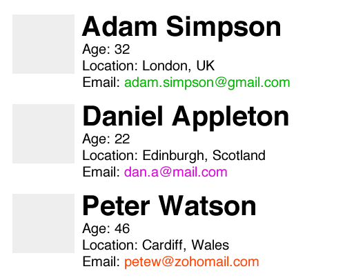

# Code Test Scope
Included in the repository is a JSON (`people.json`) file containing an array of people and their details.

## Step 1. List Users (Frontend)
We need to pull the information from the JSON file into a HTML page and list out the people and their details using either jQuery or Angular.js (preferred). For this task you must:

* Create a HTML file that contains your JS and CSS in-line.
* Pull the data from the `people.json` file as a GET request.
* List out the data onto the page in the styling shown below.

### Notes
* We want to see how you pull this data into the page so please don't simply list out each person details as hard-coded HTML.
* The styling doesn't have to be exactly but we need to see that you can use CSS. Feel free to use a compiler such as Sass if you're more comfortable with it.

## Step 2. Modify Users (Backend)
We have noticed that the ages given in the `people.json` file is incorrect, each user is actually 5 years older than stated in the JSON file. We now need to create a PHP file to pull in the JSON file's data, parse it as an array and increment each of the users age by 5 years. 

* Create a PHP file that pulls in the data within `people.json`.
* Assuming the data is correct and parse the JSON to an array.
* Add 5 years to each of the users.

### Notes 
* You can either store the JSON file locally or pull it from the repository, it's up to you.
* Don't worry about outputting the data back out, we want to see how you edit we want to see how you modify this data.
* We're not fussy about which version of PHP you use, as long as it's currently supported and stable.

## Step 3. WordPress Shortcode
Now that we have made the changes to the age, we then need to put this data into a WordPress shortcode to be displayed on the front-end of a WordPress website. Using what you have already created from Step 2 let's echo the peoples information. For this task you will need to:

* Create a WordPress shortcode which can be called on a page
* Make use of the code you created from Step 2 to echo out each persons details as a list just as you did in Step 1.

### Notes
* Make sure that you structure the list the same as you did in Step 1. so that the CSS will still work using the shortcode.
* Include your stylesheet using standard WordPress style enqueuing function. 
* Please include the shortcode functionality rather than a whole WordPress installation when sending your files back.

## That's all folks.
Please send your completed code back to us where we will review it internally and with yourself.